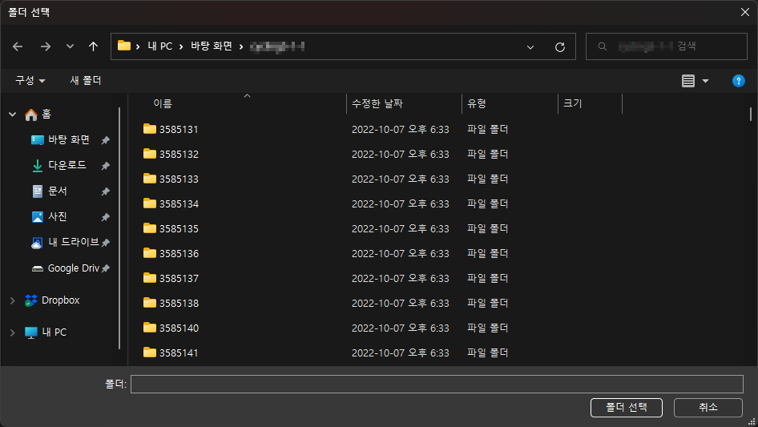
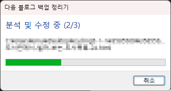

# 다음 블로그 백업 정리기

최근 [다음 블로그](https://blog.daum.net)가 서비스를 중단하면서 티스토리로 이전하지 않은 블로그들에 대한 데이터 백업 서비스를 제공하고 있습니다.

그런데 이 데이터 백업이 거의 날 데이터에 가까운 것이며, 백업된 데이터를 쉽게 모아볼 수 있는 인터페이스는 별도로 제공되지 않습니다.

또한 아주 오래된 이미지의 경우 파일은 백업되어 있으나 글의 이미지 링크가 백업된 로컬 파일을 가리키도록 수정되지 않아 글에서 이미지가 뜨지 않는 문제도 발생하고 있었습니다.

이 프로그램은 이런 문제를 개선하고자 마구잡이로 대충 만든 프로그램으로:

- 로컬 사본을 가리키지 않는 오래된 이미지 링크를 수정하려 합니다(높은 확률로 오작동합니다).
- 블로그 글을 목록으로 표시하고 카테고리별로 정렬할 수 있는 HTML 프론트엔드를 생성합니다.

필요한 사람에게 도움이 되었으면 하는 마음으로 배포하지만, 어디까지나 개인적인 용도로 제작한 프로그램이기에 완벽한 작동은 보장하지 않습니다.

백업 원본을 반드시 별도로 보관해두시기 바랍니다.

## 사용법

1) [여기](https://github.com/sinusinu/DaumBlogBackupPrettifier/releases)에서 프로그램을 다운로드합니다.

2) 다음 블로그 백업 압축파일을 적당한 곳에 압축 해제합니다.

3) 프로그램을 실행합니다.

4) "선택" 버튼을 누른 뒤 백업 파일을 압축 해제한 폴더를 선택합니다.

5) "시작" 버튼을 누르고 작업이 끝나기를 기다립니다.

6) 작업이 완료되면 해당 폴더에 새로 생긴 index.html 파일을 통해 블로그 글을 확인할 수 있습니다.

# 정보

본 프로그램은 퍼블릭 도메인으로 배포됩니다.

다음 블로그의 백업 서비스 제공 기간이 끝나면 본 프로그램도 함께 배포를 중단할 생각입니다.